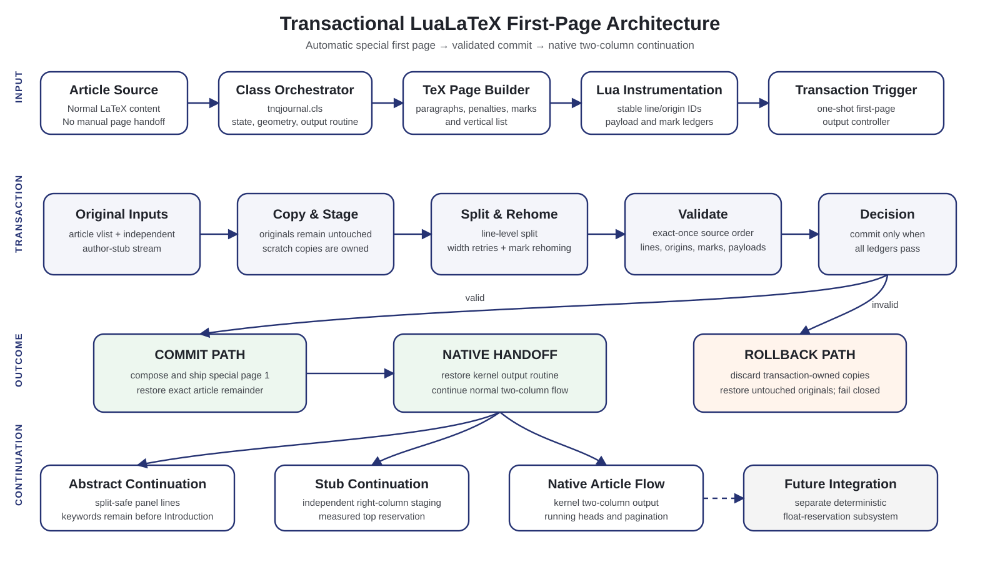

# Lua Journal First Page

Research implementation of a fully automatic LuaLaTeX journal first page followed by native two-column article flow.

## Architecture



- [Technical architecture review and production hardening plan](docs/architecture-review.md)
- [Architecture diagram as standalone SVG](docs/architecture-diagram.svg)

The engine keeps the original article page list and author-stub stream untouched while transaction-owned copies are split, rehomed and validated. A valid partition is committed and handed back to the native two-column output routine; an invalid partition is rolled back without consuming the source material.

## Current milestone

- No `\finishfirstpage`, manual `\newpage`, or source-level `\twocolumn` command.
- First-page masthead, title, abstract panel, author stub, rules, and flowing introduction.
- A one-shot output transaction splits copies of TeX's formed vertical lists and
  commits only after exact-once, source-order line validation.
- A single uninterrupted paragraph can cross the page-1/native-page boundary at
  a legal interline breakpoint without rebreaking or source markup. Its page-1
  lines are formed at the measured 344pt width and its tail at native column
  width before the transaction commits.
- Long abstracts retain a split-safe, per-line panel and remain ahead of keywords
  and Introduction.
- Long author stubs continue independently at the top of native right columns;
  article text progresses concurrently.
- Native LaTeX two-column flow resumes immediately after the first-page commit.
- Transaction ledgers cover formed lines, LaTeX mark classes, delayed writes,
  PDF destinations, and other whatsits with forced-failure rollback checks.
- Regression coverage includes exact-fit boundaries, a crossing paragraph
  followed by a list, abstracts beyond page 2, long/simultaneous stubs, headings
  near splits, running heads, deterministic rebuild hashes, and measured visual
  reference checks. Test 019 locks the supplied publication's logo, metadata,
  title lines, panel, baseline coverage, side lane, footer, and page rule.
- Footnotes while page 1 is armed and active `\DocumentMetadata` fail closed;
  their separate ownership protocols are documented but not implemented.
- Floats are intentionally excluded from this milestone.

## Build

```bash
make
make example
make test
```

Plain `make` produces both `build/neopage-technical-article.pdf` and the
article-specific visual proof `build/published-reference-profile.pdf`.

Direct compilation:

```bash
TEXINPUTS=.:src//: lualatex -interaction=nonstopmode -halt-on-error examples/neopage-technical-article.tex
```

## Repository layout

- `src/tnqjournal.cls` — class and automatic front-matter layout.
- `src/tnqjournal.lua` — stable line/paragraph origins, panel decoration, and
  transaction ledgers.
- `assets/` — publication-authorized raster crops for the journal logo, ORCID
  mark, and CC BY badge; these are visual assets, not architectural inputs.
- `examples/` — realistic NeoPage technical article.
- `tests/` — focused prose-only regressions.
- `docs/` — architecture, state machine, review notes, diagram, and known risks.

## Status

The prose-only first-page transaction is implemented and covered by automated
content-integrity, rollback, reproducibility, and visual regressions. It is
still a research prototype: floats remain owned by the separate production
system, while footnote insertion and tagged-PDF structure protocols remain
explicit fail-closed production gates.
